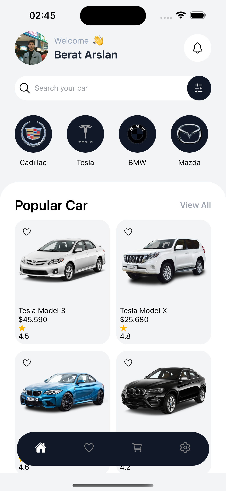

## 📱 UI Screenshot



_Welcome screen with user greeting, search functionality, brand categories, and popular cars_

### Installation

1. **Clone the repository**

   ```bash
   git clone <repository-url>
   cd rn-home-w-bnb
   ```

2. **Install dependencies**

   ```bash
   npm install
   # or
   yarn install
   ```

3. **Start the development server**

   ```bash
   npm start
   # or
   yarn start
   ```

4. **Run on specific platforms**

   ```bash
   # iOS
   npm run ios

   # Android
   npm run android

   # Web
   npm run web
   ```
